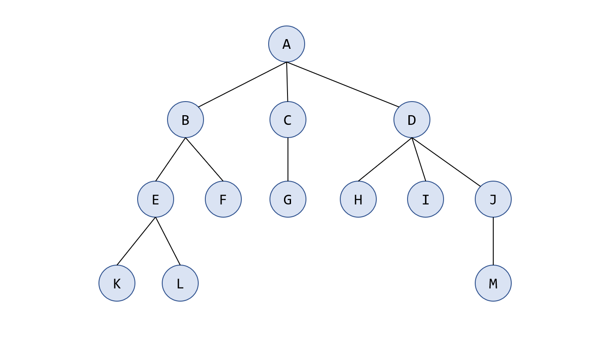
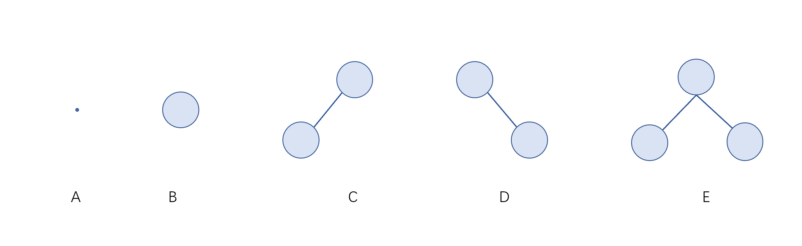
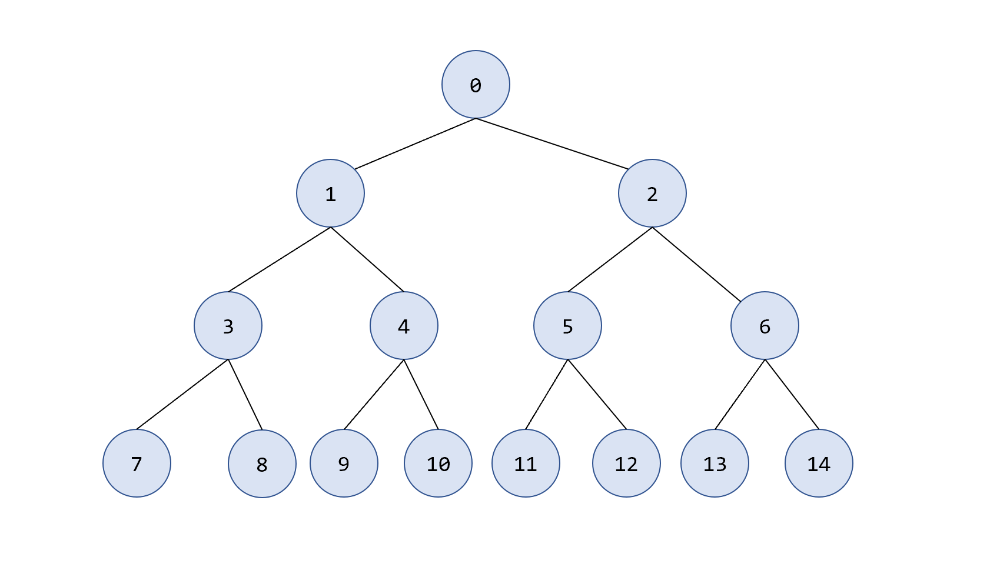
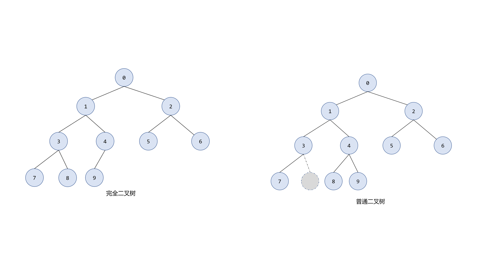
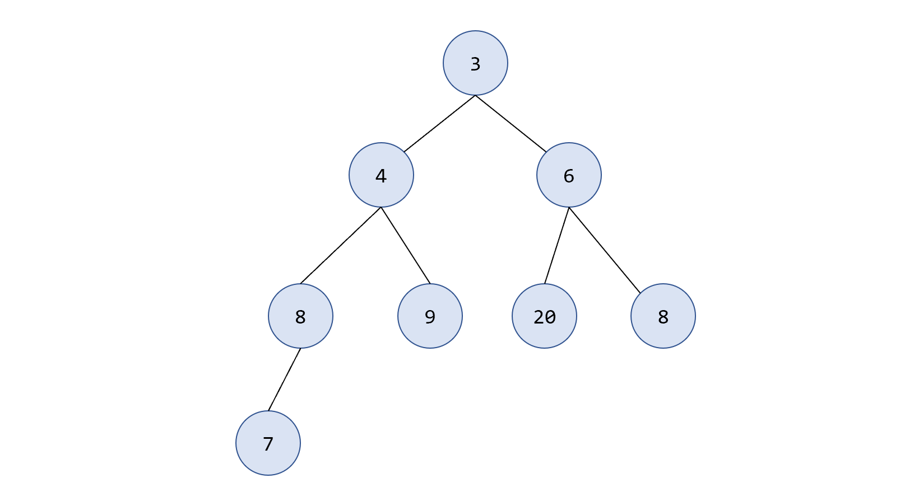
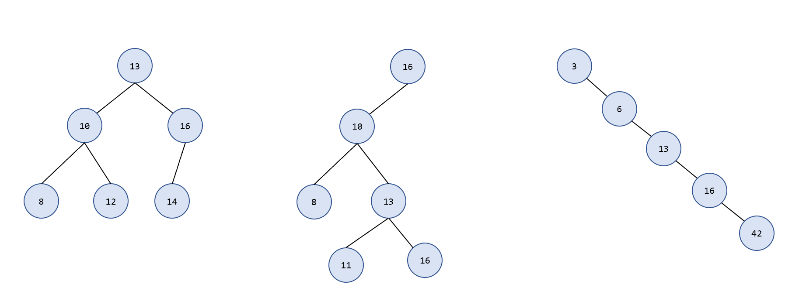
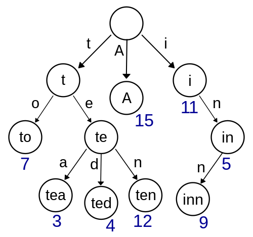
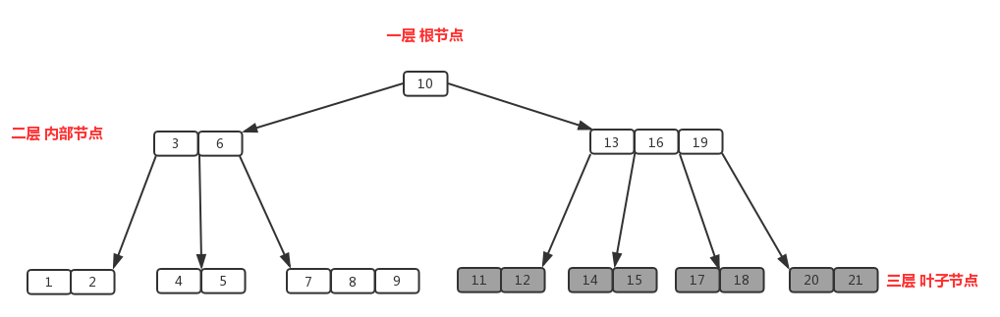
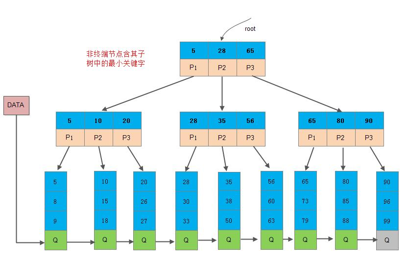

# 树的基本概念
## 树的定义

**树 (树状图) **是一种数据结构，它是由 $n(n\ge 0)$ 个结点组成一个具有层次关系的有限集合。把它叫做“树”是因为它看起来像一棵倒挂的树，也就是说它是根朝上，而叶朝下的，如下图所示：

当 $n = 0$ 时，称为空树。

**树具有以下的特点：**

- 每个结点有零个或多个子结点，如果没有子结点，称为**叶子结点**，如 K，L，F，G，H，I，M；
- 没有父结点的结点称为根结点，上图 A 是根节点；
- 每一个非根结点有且只有一个父结点，例如 C 是 G 的父节点；
- 除了根结点外，每个子结点可以分为多个不相交的子树；

思考：有 $n$ 个结点的树有多少条边？

## 基本术语

- 节点深度： 对任意节点 N，N 的深度表示为根节点到 N 的路径的长度，所以根节点深度为 0，第二层节点深度为 1，以此类推。
- 树的深度：一棵树中节点的最大深度就是树的深度，有时也称为高度。
- 祖先结点：根 A 到结点 K 的路径上的任意结点，称为结点 K 的祖先（包括自己）。
- 子孙结点：例如B 是结点 K 的祖先，而结点 K 是结点 B  的子孙。
- 双亲结点：路径上最接近结点 K 的结点 E 称为 K 的双亲，而 K 为结点 E 的孩子。根 A 是树中唯一没有双亲的结点。
- 兄弟结点：有相同双亲的结点称为兄弟，如结点 K 和结点 L 有相同的双亲 E，即 K 和 L 为兄弟。
- 结点的度：一个结点的孩子个数称为该结点的度，树中结点的最大度数称为树的度。例如结点 B 的度为2，结点 D 的度为3，树的度为 3。

- 路径和路径长度：树中两个结点之间的路径是由这两个结点之间所经过的结点序列构成的，而路径长度是路径上所经过的边的个数。

## 树的性质
- 树中的结点数等于所有结点的度数之和加1.
  【证明】因为结点的度定义为该结点孩子的个数，所以所有结点的度之和为所有孩子结点的个数，因为根不是任何结点的孩子，所以树中的结点数等于所有结点的度数之和加1。

- 度为 $m$ 的树中第 $i$ 层上至多有 $m^{ i − 1}$ 个结点。
- 高度为 $h$ 的 $m$ 叉树至多有 $\frac{m^{i-1}}{m-1}$ 个结点。

# 树的分类

根据一个节点最多有几个“叉”，即最多有几个子结点，我们可以把树分成两类：二叉树和多叉树。二叉树的每个结点最多有两个孩子结点，多叉树的孩子结点可以超过两个。有没有单叉树呢？有的，单叉树其实就是链表，一般没有人会把链表叫做单叉树。

## 二叉树

二叉树最多有两个孩子结点，称为左子树和右子树，并且他们是有序的，不能颠倒，就像左右护法一样，是有差别的。二叉树有如下五种基本形态：

**满二叉树**

如果叶子节点全都在最底层，除了叶子节点之外，每个节点都有左右两个子节点，这种二叉树就叫做满二叉树。满二叉树每一层的叶子节点个数都是满的。

**完全二叉树**

叶子结点都在最底下两层，最后一层的叶子结点都靠左排列，并且除了最后一层，其他层的结点个数都要达到最大，这种二叉树叫做完全二叉树。

**堆**

**小顶堆**是一种完全二叉树，堆中每个根结点的值都小于或等于其左右子节点的值。如果根结点的值大于或等于其左右子节点的值，则称为**大顶堆**。

**二叉查找树**

树中的任意一个节点，其左子树中的每个节点的值，都要小于这个节点的值，而右子树节点的值都大于这个节点的值。

**平衡二叉树(AVL)**

平衡二叉树的定义：二叉树中任意一个节点的左右子树的高度相差不能大于 1。

**平衡二叉查找树**

为了防止二叉查找树退化为链表，导致查询的效率大幅下降，所以又发明了平衡二叉查找树。平衡二叉查找树在二叉查找树的定义上又增加了1点，规定二叉查找树中任意一个节点的左右子树的高度相差不能大于 1。

**红黑树**

红黑树中的节点，一类被标记为黑色，一类被标记为红色，它是一种不严格的平衡二叉查找树。它要满足这样几个要求：

- 根节点是黑色的；
- 每个叶子节点都是黑色的空节点（NIL），也就是说，叶子节点不存储数据；
- 任何相邻的节点都不能同时为红色，也就是说，红色节点是被黑色节点隔开的；
- 每个节点，从该节点到达其可达叶子节点的所有路径，都包含相同数目的黑色节点；

图片选自维基百科。

## 多叉树

**Trie树**

Trie 树，也叫“字典树”。它是一种专门处理字符串匹配的数据结构，用来解决在一组字符串集合中快速查找某个字符串的问题。Trie 树的本质，就是利用字符串之间的公共前缀，将重复的前缀合并在一起。

**B-树**

B- 树，也称为B树，是一种平衡的多叉树（可以对比一下平衡二叉查找树），它比较适用于对外查找。一颗 $m$ 阶的B- 树，有以下特征：

- 根结点至少有两个孩子；
- 每个节点最多有 $m$ 个子结点；每个内部结点最少有 $⌈m/2⌉$ 个子节点
- 具有 $N$ 个子结点的非叶子节点拥有 $N-1$ 个键
- 所有的叶子结点都位于同一层。

注：**键**：B树中的存储元素是键，是用于指向数据记录的指针。键的值是用于存储真正的数据记录。一个节点中可以拥有多个键。

**B+树**

B+树是 mysql 数据库底层的存储结构，它是一个多叉树，特点如下：

- 每个节点中子节点的个数不能超过 $m$，也不能小于 $m/2$；
- 根节点的子节点个数可以不超过 $m/2$，这是一个例外；
- $m$ 叉树只存储索引，并不真正存储数据，这个有点儿类似跳表；
- 通过链表将叶子节点串联在一起，这样可以方便按区间查找；
- 一般情况，根节点会被存储在内存中，其他节点存储在磁盘中。

# 参考文章

1. 树的基本概念：https://blog.csdn.net/Real_Fool_/article/details/113930623
1. B 树：https://segmentfault.com/a/1190000038749020

